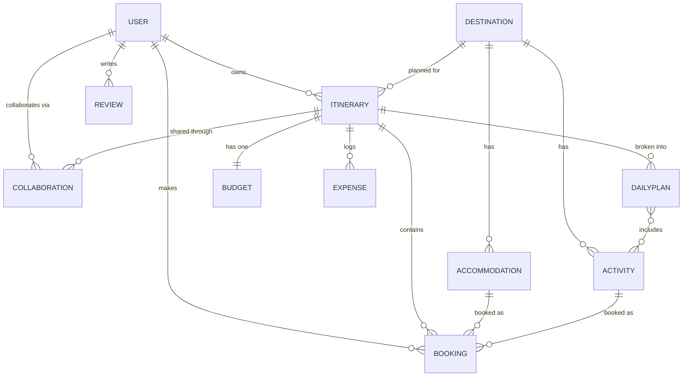

# Travel Itinerary Planning & Booking API

A RESTful API for a travel platform, built with Django and Django REST Framework.
Users can search destinations, build day-by-day itineraries, book accommodations
and activities, track budgets, collaborate with travel companions, and leave
reviews — all secured with JWT authentication and object-level permissions.

## Technologies

- **Django 4.2** + **Django REST Framework** — the API
- **Simple JWT** — token authentication
- **django-filter** — filtering and search
- **drf-spectacular** — OpenAPI schema, Swagger, and ReDoc
- **python-decouple** — environment-based settings
- **Pillow** — image uploads
- **pytest / pytest-django / coverage** — testing
- **SQLite** by default (swap to PostgreSQL via `.env`)

## Getting started

```bash
# 1. clone, then create and activate a virtualenv
python3 -m venv venv
source venv/bin/activate          # Windows: venv\Scripts\activate

# 2. install dependencies
pip install -r requirements.txt

# 3. set up your environment file
cp .env.example .env              # then edit SECRET_KEY etc.

# 4. run migrations
python manage.py migrate

# 5. create an admin user
python manage.py createsuperuser

# 6. run it
python manage.py runserver
```

The API is then at `http://127.0.0.1:8000/`.

### Environment variables (`.env`)

| Variable | What it's for | Default |
|----------|---------------|---------|
| `SECRET_KEY` | Django secret key (required) | — |
| `DEBUG` | Debug mode | `False` |
| `ALLOWED_HOSTS` | Comma-separated hosts | `localhost,127.0.0.1` |
| `DB_ENGINE` / `DB_NAME` … | Database config | SQLite |

The `.env` file and `db.sqlite3` are gitignored — never commit them.

## Running the tests

```bash
pytest                            # run the suite (47 tests)
pytest --cov=. --cov-report=term  # with coverage (~88%)
```

## Documentation

With the server running:

- **Swagger UI** — `http://127.0.0.1:8000/api/docs/`
- **ReDoc** — `http://127.0.0.1:8000/api/redoc/`
- **Raw schema** — `http://127.0.0.1:8000/api/schema/`

## Authentication flow

The API uses JWT. Register or log in to get an `access` + `refresh` token pair,
then send the access token as a `Bearer` header on every protected request.

```bash
# register (returns user + tokens)
curl -X POST http://127.0.0.1:8000/api/v1/accounts/register/ \
  -H "Content-Type: application/json" \
  -d '{"username":"maya","email":"maya@example.com","password":"Str0ngPass!23","password2":"Str0ngPass!23"}'

# use the access token on a protected endpoint
curl http://127.0.0.1:8000/api/v1/itineraries/ \
  -H "Authorization: Bearer <access-token>"

# refresh an expired access token
curl -X POST http://127.0.0.1:8000/api/v1/accounts/token/refresh/ \
  -H "Content-Type: application/json" -d '{"refresh":"<refresh-token>"}'
```

## Key endpoints

All routes are versioned under `/api/v1/`.

| Area | Endpoint | Notes |
|------|----------|-------|
| Auth | `accounts/register/`, `accounts/login/`, `accounts/token/refresh/` | Get / refresh tokens |
| Profile | `accounts/profile/`, `accounts/password/change/` | Manage your account |
| Destinations | `destinations/` (+ `search/`, `country/<name>/`) | Browse (read-only) |
| Itineraries | `itineraries/` | Full CRUD + `duplicate/`, `upcoming/`, `share/` |
| Bookings | `bookings/` | CRUD + `confirm/`, `cancel/`, `bulk-update/` |
| Reviews | `reviews/` | CRUD, author-only edits |
| Budgets | `budgets/`, `expenses/` | Per-trip budgets and expenses |
| Analytics | `analytics/`, `analytics/budget_summary/` | Cross-trip stats |

## Entity relationship diagram



## Project structure

```
travel_api/
├── travel_api/      # settings, root urls, pagination
├── accounts/        # custom User model + JWT auth
├── destinations/    # destinations + search/filter
├── itineraries/     # trips, collaborations, daily plans
├── bookings/        # accommodations, activities, bookings
├── reviews/         # ratings and reviews
├── budgets/         # budgets and expenses
├── requirements.txt
├── .env.example
└── manage.py
```

Each app follows Django conventions: `models.py`, `serializers.py`, `views.py`,
`urls.py`, `permissions.py` (where relevant), `filters.py`, and `tests.py`.

## Notes

- `DEBUG` defaults to `False` and the `SECRET_KEY` comes from the environment —
  no secrets in source.
